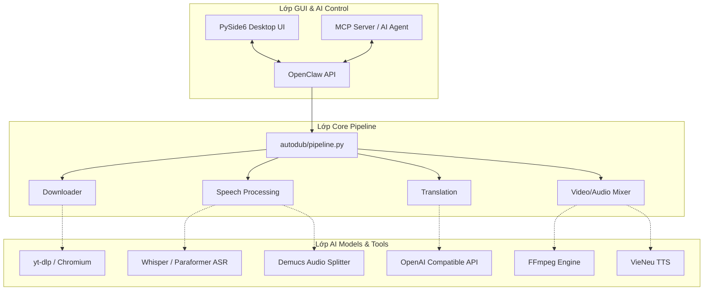

<div align="center">
  
  <h1>DubFlow</h1>
  <p><b>Hệ thống Lồng tiếng Tiếng Việt Tự động (AI Dubbing) & Xử lý Video Toàn diện</b></p>
  
  [](LICENSE)
  [](https://www.python.org/)
  [](https://doc.qt.io/qtforpython/)
  [](#6-ai-control--mcp-server)
</div>

<hr />

## 🌟 1. Giới thiệu & Cảm hứng (Inspiration)

**DubFlow** là một ứng dụng Desktop mã nguồn mở (hỗ trợ Windows/Linux) được thiết kế để tự động hóa hoàn toàn quy trình lồng tiếng (dubbing) video nước ngoài sang Tiếng Việt. 

Dự án này được **xây dựng và phát triển lại từ ý tưởng gốc của mã nguồn [VoxDub](https://github.com/ttthanh2044/voxdub)** của tác giả `ttthanh2044`. DubFlow kế thừa tầm nhìn của VoxDub nhưng được tái cấu trúc (refactor) toàn diện về cả Kiến trúc phần mềm (Pipeline Architecture), Giao diện người dùng (Modern Dark UI/UX) và Khả năng tự động hóa (AI/MCP Control).

**Tại sao chọn DubFlow?**
- 🚀 **Tự động 100%**: Chỉ cần ném link (YouTube, TikTok, Douyin, Bilibili) hoặc file MP4, phần mềm sẽ tự bóc băng, dịch, lồng tiếng và mix nhạc nền.
- 💻 **Chạy hoàn toàn trên máy cá nhân (Local)**: Đảm bảo quyền riêng tư, không lo rò rỉ dữ liệu.
- 🤖 **AI-Native**: Hỗ trợ giao thức MCP, cho phép các AI Assistant (Claude, Gemini) trực tiếp điều khiển app thay con người!
- 🎨 **UI/UX Chuyên nghiệp**: Giao diện Modern Dark Theme (chuẩn Cursor/Linear) tối giản, tinh tế, tích hợp Timeline chuyên nghiệp.

---

## 🏗️ 2. Kiến trúc Hệ thống (System Architecture)

Hệ thống được chia làm 3 lớp (layers) rõ rệt, kết nối bằng cơ chế caching theo file để tránh phải chạy lại từ đầu nếu có lỗi:



### Luồng xử lý dữ liệu (Data Flow)
1. **Input**: Tải video / Tách âm thanh `original_audio.wav`.
2. **Tách nhạc nền**: Dùng Demucs để chia thành `vocals.wav` (Giọng nói) và `no_vocals.wav` (Nhạc nền).
3. **ASR (Bóc băng)**: Whisper/Paraformer chuyển `vocals.wav` thành văn bản (Subtitle gốc).
4. **Translate**: Dịch ngữ cảnh (hỗ trợ thuật ngữ, prompt tùy chỉnh) sang Tiếng Việt.
5. **TTS (Lồng tiếng)**: VieNeu tạo ra `audio_vi_full.wav` với thời lượng khớp chính xác (Time-stretch) với câu gốc.
6. **Mix**: Trộn nhạc nền + Giọng Việt + In phụ đề cứng + Xóa chữ gốc (OCR Blur) -> `dubbed_video.mp4`.

---

## 📖 3. Hướng dẫn sử dụng từng chức năng

### 3.1. Tạo Dự án Lồng tiếng (Single Project)
Đây là tính năng cốt lõi. Bạn làm theo các bước sau:
1. Mở thẻ **Lồng tiếng**.
2. Dán đường link video (hoặc chọn file từ máy).
3. Cấu hình các thông số:
   - **Xử lý nhạc nền**: Chọn *Demucs* (chất lượng cao) hoặc *Duck* (nhanh).
   - **Phụ đề**: Chọn xuất file `.srt` rời hoặc *Hardsub* (in thẳng vào video).
   - **Che chữ gốc (OCR Blur)**: Bật tính năng này nếu video gốc có phụ đề cứng, AI sẽ tự động khoanh vùng và làm mờ chữ gốc.
4. Nhấn **Bắt đầu** và theo dõi tiến trình.

### 3.2. Chế độ Xử lý Hàng loạt (Batch Processing)
Dành cho người làm nội dung số (Reup/Creator):
1. Chuyển sang thẻ **Hàng loạt (Batch)**.
2. Dán nhiều link, mỗi link một dòng. Hỗ trợ cú pháp ghi chú và ép kiểu giọng đọc:
   ```text
   https://youtu.be/abc123 | nam
   https://www.douyin.com/video/789 | nu
   # Đây là video dự phòng
   ```
3. Nhấn bắt đầu. Tiến trình sẽ được lưu lại (State). Nếu tắt máy, lần sau mở lên app sẽ tự chạy tiếp.

### 3.3. Trình chỉnh sửa (Editor / Timeline)
Sau khi AI dịch xong, bạn có thể chỉnh sửa thủ công để văn phong tự nhiên hơn:
- **Giao diện 2 cột**: Cột trái là phụ đề gốc, cột phải là phụ đề Việt.
- **Nghe thử từng câu**: Bấm vào nút Play bên cạnh mỗi câu để nghe giọng AI đọc xem đã chuẩn chưa.
- **Chỉnh sửa**: Click vào ô chữ để gõ lại. Khi lưu, AI sẽ chỉ tạo lại giọng đọc cho những câu bạn vừa sửa (rất tiết kiệm thời gian).
- **Xuất file**: Bạn có thể xuất lại Video, hoặc chỉ xuất âm thanh (MP3/WAV) và phụ đề (.ass, .srt).

### 3.4. Thư viện Giọng nói AI (Voices)
- Hỗ trợ công cụ **VieNeu TTS**.
- Bạn có thể tải thêm Preset (có sẵn trong `voices/preset_voices_vn/`).
- Hỗ trợ **Voice Cloning** (Sao chép giọng): Cung cấp một đoạn âm thanh ngắn (3-10 giây) của một người, AI sẽ clone giọng người đó để đọc tiếng Việt. *(Lưu ý: Chỉ sử dụng cho mục đích hợp pháp, không giả mạo).*

### 3.5. Dịch thuật Chuyên sâu
Tại thẻ **Cài đặt**, bạn có thể tinh chỉnh AI Dịch thuật:
- Cấu hình API tương thích OpenAI (`/chat/completions`).
- Thiết lập **Chủ đề** (VD: *Review phim, Khoa học vũ trụ*).
- Thiết lập **Danh xưng** (VD: *Tôi - Các bạn, Huynh - Muội*).
- Thêm **Thuật ngữ (Glossary)** để ép AI dịch các từ chuyên ngành đúng ý bạn.

---

## 🤖 4. AI Control & MCP Server (Tính năng Độc quyền)

DubFlow là một trong những ứng dụng tiên phong hỗ trợ **Điều khiển hoàn toàn bởi AI (AI-Native)** thông qua giao thức MCP (Model Context Protocol).

Bạn có thể kết nối DubFlow với **Claude Desktop**, **Cursor**, hoặc **Cline**. Sau đó, bạn chỉ cần chat:
> *"Claude, tải video tiktok này về, đổi giọng nam miền Nam rồi lồng tiếng tiếng Việt cho tôi."*

**Cách cài đặt:**
Thêm đoạn sau vào file cấu hình của Claude Desktop (thường ở `%APPDATA%\Claude\claude_desktop_config.json`):
```json
{
  "mcpServers": {
    "dubflow": {
      "command": "C:/Đường/Dẫn/Tới/DubFlow/.venv/Scripts/python.exe",
      "args": ["C:/Đường/Dẫn/Tới/DubFlow/mcp_server.py"]
    }
  }
}
```
*Lưu ý: Đổi đường dẫn cho khớp với thư mục cài đặt thực tế của bạn.*

Hệ thống cung cấp sẵn một API linh hoạt (`OpenClaw API` port `38643`) để AI tương tác trực tiếp mà không cần bạn phải động tay vào chuột!

---

## ⚙️ 5. Cài đặt & Triển khai (Setup)

### Yêu cầu hệ thống
- **Hệ điều hành**: Windows 10/11 hoặc Linux.
- **Phần cứng**: Khuyến nghị có GPU NVIDIA (RAM >= 8GB) để chạy Whisper và Demucs nhanh hơn. Nếu không có GPU, phần mềm sẽ tự chuyển sang chạy bằng CPU (chậm hơn).
- **Phần mềm**: Python 3.10+ và FFmpeg.

### Cách cài đặt từ Source
1. Clone repo: `git clone https://github.com/thaikhang113/dubflow.git`
2. Chạy file cài đặt tự động (Windows): Mở `cai_dat_all.bat`. Script sẽ tự động tạo Virtual Environment (`.venv`), cài các thư viện PyTorch, PySide6, và tải sẵn các model cần thiết.
3. Chạy phần mềm: Bấm vào `chay_app.bat` hoặc lệnh `python -m autodub_gui`.

*(Phần mềm tự động phát hiện module còn thiếu và sẽ hiển thị Preflight Check cảnh báo ngay khi khởi động).*

---

## 💻 6. Dành cho Developer (Contribution)

### Cấu trúc mã nguồn
- `autodub/`: Chứa toàn bộ Backend Core Logic (tách biệt hoàn toàn khỏi giao diện).
  - `media/`: Downloader, Demucs, FFmpeg wrapper.
  - `speech/`: ASR (Whisper/Paraformer) và TTS (VieNeu).
  - `openclaw_runtime.py`: Máy chủ HTTP nội bộ xử lý lệnh gọi từ GUI và MCP.
- `autodub_gui/`: Lớp Frontend (PySide6).
  - `tokens.py`, `theme.py`: Định nghĩa toàn bộ Design System.
- `mcp_server.py`: Cầu nối giao tiếp với các AI Client ngoài.

### Đóng gói (Build Release)
Bạn có thể tự đóng gói thành file `.exe` cho Windows:
```powershell
python scripts/build_exe.py --no-test
```

### Đóng góp mã (Contributing)
Mọi Pull Request cải thiện UI/UX, thêm model TTS mới hoặc sửa lỗi đều được hoan nghênh. Xin vui lòng không commit các file API keys, cookies, hoặc dung lượng quá lớn vào repo.

---
**Giấy phép (License)**: Dự án phát hành dưới giấy phép MIT. Các model AI (Whisper, Demucs, VieNeu) đi kèm có thể phụ thuộc vào giấy phép riêng của từng tác giả. Vui lòng kiểm tra kỹ trước khi thương mại hóa.
