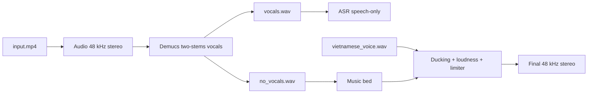
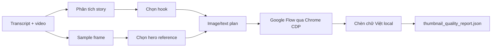
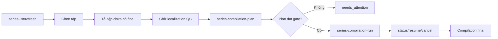

# Auto Vietsub Chinese Video

Hệ thống tự động tải video Trung Quốc, lấy transcript, dịch sang tiếng Việt, tạo giọng lồng tiếng, giữ hoặc tách nhạc nền, đồng bộ âm thanh theo timeline, che phụ đề Trung, chèn phụ đề Việt, tạo thumbnail và tổng hợp nhiều tập thành video dài.

Tài liệu này mô tả pipeline lõi từ nhánh `khang` và ứng dụng web Docker trên nhánh `tool`. Các thư mục tích hợp Grok không thuộc phạm vi tài liệu.

## Trạng thái hiện tại

- Pipeline lõi: `skills/douyin-vietnamese-dubber/run.sh`.
- Nguồn đầu vào: file video local, URL Douyin/TikTok và URL Bilibili.
- Bilibili: tải qua Chrome CDP đã đăng nhập và `yt-dlp`, sau đó tái sử dụng pipeline lõi.
- ASR: `whisper.cpp`.
- OCR subtitle: 9Router vision, có đường fallback được cấu hình trong runtime.
- Dịch: Ollama mặc định; 9Router là đường opt-in.
- TTS: AI33, Kokoro, Resona hoặc Edge TTS tùy voice registry/preset.
- AI33 chạy tối đa 3 worker song song để tránh rate limit.
- Audio TTS chuẩn: 48 kHz mono; audio final: 48 kHz stereo AAC.
- Nhạc nền: ưu tiên stem `no_vocals.wav` từ Demucs, có ducking khi giọng Việt phát.
- Subtitle final: detect vùng chữ Trung, blur vùng đó và burn-in phụ đề Việt.
- Output chính: `final_video_vi.mp4`.
- Web local: queue FIFO, provider, Bilibili QR/cookie, theo dõi kênh, Series, Trend, Telegram và Settings tại `http://127.0.0.1:18793`.
- Series: theo dõi tập, tải tập thiếu, kiểm quality gate, lập plan và compile theo thứ tự nguồn.
- HyperFrames: hiện chỉ có kiểm tra availability và dry-run; chưa phải renderer book-video hoàn chỉnh.

> Trạng thái code không thay thế kiểm thử runtime. AI33, Ollama/9Router, Bilibili, Google Flow và E2E video thật còn phụ thuộc dịch vụ, tài khoản, quota và secret tương ứng.

## Mục lục

1. [Kiến trúc tổng thể](#kiến-trúc-tổng-thể)
2. [Luồng dữ liệu](#luồng-dữ-liệu)
3. [Pipeline video chi tiết](#pipeline-video-chi-tiết)
4. [Tách giọng và giữ nhạc nền](#tách-giọng-và-giữ-nhạc-nền)
5. [Transcript, ASR và OCR](#transcript-asr-và-ocr)
6. [Dịch và tối ưu câu lồng tiếng](#dịch-và-tối-ưu-câu-lồng-tiếng)
7. [TTS và voice registry](#tts-và-voice-registry)
8. [Đồng bộ giọng và video](#đồng-bộ-giọng-và-video)
9. [Phụ đề và che chữ Trung](#phụ-đề-và-che-chữ-trung)
10. [Mix audio final](#mix-audio-final)
11. [Thumbnail](#thumbnail)
12. [Series và compilation](#series-và-compilation)
13. [Host runner, container và Telegram](#host-runner-container-và-telegram)
14. [Cấu trúc thư mục](#cấu-trúc-thư-mục)
15. [Danh mục file](#danh-mục-file)
16. [Artifact của một job](#artifact-của-một-job)
17. [Cấu hình môi trường](#cấu-hình-môi-trường)
18. [Cài đặt và chạy](#cài-đặt-và-chạy)
19. [Resume, cache và retry](#resume-cache-và-retry)
20. [Trạng thái và lỗi](#trạng-thái-và-lỗi)
21. [Kiểm thử](#kiểm-thử)
22. [Bảo mật](#bảo-mật)
23. [Giới hạn đã biết](#giới-hạn-đã-biết)
24. [Xử lý sự cố](#xử-lý-sự-cố)

## Kiến trúc tổng thể

```mermaid
flowchart LR
    U[Người dùng / Telegram / OpenClaw] --> HR[Host runner allowlist]
    HR --> BI[Bilibili wrapper]
    HR --> DY[Douyin wrapper]
    HR --> SR[Series tracker / compilation]

    BI --> CDP[Chrome CDP đã đăng nhập]
    BI --> YTDLP[yt-dlp]
    DY --> DYS[Douyin Stealth / yt-dlp]

    CDP --> INPUT[input.mp4]
    YTDLP --> INPUT
    DYS --> INPUT
    LOCAL[Video local] --> INPUT

    INPUT --> CORE[Pipeline lõi run.sh]
    CORE --> SEP[Demucs + speech segmentation]
    SEP --> ASR[Whisper ASR]
    INPUT --> OCR[OCR subtitle]
    ASR --> TXSEL[Chọn transcript + QC]
    OCR --> TXSEL
    TXSEL --> TRANS[Dịch + timing optimizer]
    TRANS --> TTS[TTS provider]
    TTS --> SYNC[Voice-sync gate]
    SEP --> MIX[Music bed]
    SYNC --> MIX
    INPUT --> MIX
    MIX --> SUB[Mask chữ Trung + sub Việt]
    SUB --> FINAL[final_video_vi.mp4]
    FINAL --> THUMB[Google Flow thumbnail]
    FINAL --> ORG[Organize output]
    FINAL --> SERIES[Series compilation]
```



### Ranh giới trách nhiệm

| Thành phần | Trách nhiệm |
|---|---|
| OpenClaw/Telegram | Nhận yêu cầu ngôn ngữ tự nhiên, chọn action allowlist, báo trạng thái |
| Host runner | Chuyển action từ container sang Linux host, quản lý queue và lock |
| Bilibili wrapper | Chuẩn hóa URL, lấy cookie/meta qua CDP, tải video, gọi pipeline lõi |
| Douyin wrapper | Resolve/tải video Douyin hoặc nhận video local |
| Pipeline lõi | Toàn bộ preprocess, transcript, dịch, TTS, sync, mix, subtitle, QC |
| Thumbnail skill | Chọn frame, tạo prompt, gọi Google Flow, chèn chữ Việt local |
| Series tracker | Lưu series, tập, trạng thái download/localization và output |
| Compilation orchestrator | Plan, gate, branding tùy chọn, nối video và resume |

## Luồng dữ liệu

```text
URL hoặc file local
  -> input.mp4
  -> audio.wav
  -> vocals.wav + no_vocals.wav
  -> asr_speech.wav + speech_regions.json
  -> original ASR/OCR SRT
  -> selected_transcript.srt
  -> vietnamese.srt + dub.srt
  -> WAV TTS từng cue
  -> vietnamese_voice.wav
  -> voice_sync_quality_report.json
  -> final_video_audio_only.mp4
  -> final_video_vi.mp4
  -> final_mix_quality_report.json
  -> thumbnail.jpg
  -> thư viện "Phim đã xử lý"
```

`selected_transcript.srt` là transcript nguồn chuẩn sau bước chọn ASR/OCR. `vietnamese.srt` dùng để hiển thị. `dub.srt` có thể được rút gọn để TTS đọc tự nhiên và vừa timeline.

## Pipeline video chi tiết

### 1. Tạo job và kiểm tra runtime

Pipeline tạo thư mục job, `job_status.json`, file nguồn và lock. Doctor kiểm tra các binary, model, provider và quyền ghi.

Trạng thái đầu:

| Progress | Phase | Ý nghĩa |
|---:|---|---|
| 3% | `queued` | Đã tạo job |
| 5% | `queued` | Kiểm runtime và lock |

### 2. Nhận video

- File local: copy vào `input.mp4`.
- Douyin/TikTok: thử downloader CDP/stealth, sau đó fallback `yt-dlp` khi được phép.
- Bilibili: wrapper chuẩn hóa URL, bỏ query tracking và fragment, lấy cookie từ Chrome CDP, tải bằng `yt-dlp`.

URL Bilibili:

```text
https://www.bilibili.com/video/BV19Az6Y6EL6/?vd_source=abc#reply
```

được chuẩn hóa thành:

```text
https://www.bilibili.com/video/BV19Az6Y6EL6/
```

| Progress | Phase | Ý nghĩa |
|---:|---|---|
| 8% | `download` | Đang tải |
| 15% | `download` | Đã có `input.mp4` |

### 3. Tiền xử lý audio

`speech_only_preprocess.py`:

1. Tách audio 48 kHz stereo làm đầu vào Demucs.
2. Chạy `demucs --two-stems=vocals`.
3. Tạo `vocals.wav` và `no_vocals.wav`.
4. Chuyển vocals về 16 kHz mono.
5. Dùng `inaSpeechSegmenter`; nếu không có thì dùng energy VAD.
6. Giữ nguyên timeline nhưng silence vùng nhạc/noise/non-speech.
7. Xuất `asr_speech.wav` cho Whisper.

| Progress | Phase | Ý nghĩa |
|---:|---|---|
| 18% | `preprocess` | Tách giọng/nhạc |
| 30% | `preprocess` | Preprocess xong |

### 4. Whisper ASR

`whisper-cli` đọc `asr_speech.wav`, tạo transcript SRT. `postprocess_asr_srt.py` lọc:

- segment ngoài vùng speech;
- câu lặp bất thường;
- câu quá ngắn hoặc vô nghĩa;
- hallucination trong vùng nhạc/noise.

| Progress | Phase | Ý nghĩa |
|---:|---|---|
| 32% | `asr` | Đang chạy Whisper |
| 42% | `asr` | Có transcript ASR |
| 43-45% | `postprocess_asr` | Lọc transcript |

### 5. OCR subtitle

Khi `SUBTITLE_TRANSCRIPT_SOURCE=auto` hoặc `ocr`, pipeline đọc subtitle gốc trong video:

- mặc định dùng `9router_vision`;
- giới hạn FPS, frame stride, số frame và timeout;
- ghi report partial trước khi timeout;
- OCR lỗi không tự động làm hỏng job nếu ASR đạt QC;
- OCR rỗng được ghi rõ, không giả là thành công.

### 6. Chọn transcript và quality gate

`choose_transcript_source.py` so sánh ASR và OCR:

- coverage theo thời lượng;
- cue density;
- câu lặp;
- cue quá dài nhưng ít chữ;
- chất lượng OCR;
- độ nghiêm trọng của lỗi ASR.

Kết quả ghi vào `transcript_source_decision.json`. Nếu cả ASR và OCR không đạt, pipeline dừng với `TranscriptSourcesFailedQC`.

`asr_timing_repair.py` có thể tạo sidecar timing để chẩn đoán, nhưng không thay đổi transcript chuẩn đã chọn.

### 7. Dịch và tối ưu timing

`viet_dub_timing_optimizer.py`:

1. Đọc `selected_transcript.srt`.
2. Nạp translation memory toàn cục, theo thể loại và series.
3. Dịch batch sang tiếng Việt.
4. Retry batch nhỏ hơn khi JSON/API lỗi.
5. Kiểm tra tiếng Việt và CJK leakage.
6. Nhóm hoặc rút gọn câu để vừa slot.
7. Tạo:
   - `vietnamese.srt`: bản hiển thị;
   - `dub.srt`: bản đọc TTS;
   - `dubbing_segments.json`;
   - `dubbing_report.json`.

| Progress | Phase | Ý nghĩa |
|---:|---|---|
| 46% | `optimizer` | Dịch và tối ưu |
| 58-60% | `optimizer` hoặc `manual_translate` | Đã dịch hoặc cần can thiệp |

### 8. TTS theo cue

Pipeline tạo WAV riêng cho từng cue, có checkpoint và resume. Provider được chọn từ voice chuẩn:

- `ai33:<voice_id>`;
- `kokoro:<voice>`;
- `resona:<voice_id>`;
- `nam`, `nu` hoặc `vi-VN-*` cho Edge TTS.

AI33:

- tối đa 3 worker;
- retry provider có phân loại;
- circuit breaker cho auth/quota/network/provider failure;
- checkpoint theo text, voice, settings và source fingerprint;
- không dùng silent fallback để giả thành công;
- probe audio nguồn trước conversion;
- nguồn thấp hơn 48 kHz bị trả `AI33SourceSampleRateLow`;
- chỉ cue lỗi chất lượng được force-regenerate;
- mặc định retry chất lượng nguồn 1 lần;
- conversion dùng `aresample`, không dùng `asetrate`, nên không làm đổi pitch.

| Progress | Phase | Ý nghĩa |
|---:|---|---|
| 66% | `tts_generation` | Sinh giọng |
| 78% | voice-sync gate | Kiểm tra giọng và timeline |

### 9. Đồng bộ voice

Mỗi cue được đặt đúng timestamp. Pipeline đo:

- start drift;
- final drift;
- overhang;
- overlap chưa xử lý;
- tỷ lệ synthetic padding;
- median fill;
- cue bị trim;
- tổng duration voice và video.

Kết quả bắt buộc nằm trong `voice_sync_quality_report.json`. Report thiếu hoặc lỗi cấu trúc không được phép đi tiếp sang organize.

### 10. Chọn nhạc nền và mix

`BGM_MODE` quyết định nguồn background:

- `auto`: ưu tiên `no_vocals.wav`, không có thì dùng `BGM_MODE_FALLBACK`;
- `demucs`: bắt buộc stem sạch;
- `duck`: dùng audio nguồn và hạ nền khi giọng Việt phát;
- `none`: chỉ giọng Việt.

Mặc định an toàn là không dùng audio nguồn làm nhạc nền nếu điều đó giữ lại giọng Trung.

### 11. Render subtitle

`subtitle_mask_render.py`:

1. Detect vùng subtitle gốc.
2. Lưu geometry vào `subtitle_region.json`.
3. Track vùng chữ theo source khi bật.
4. Blur vùng chữ Trung.
5. Fit font/wrap theo từng cue Việt.
6. Burn-in subtitle Việt.
7. Chạy readability gate.

### 12. Kiểm duration và final mix

Pipeline tạo:

- `final_video_audio_only.mp4`;
- `final_video_vi.mp4`;
- `timeline_duration_report.json`;
- `final_mix_quality_report.json`.

Video chỉ được organize khi:

- subtitle Việt hợp lệ;
- `dub.srt` không còn toàn tiếng Trung;
- TTS có giọng thật;
- voice-sync report hợp lệ;
- output video tồn tại và duration đạt gate.

### 13. Thumbnail và organize

Thumbnail lỗi chỉ cảnh báo, không làm mất video đã hoàn thành. Sau final gate, `organize_output.py` copy output dùng cho người cuối vào thư viện `Phim đã xử lý`.

| Progress | Phase | Ý nghĩa |
|---:|---|---|
| 80-88% | `mux` / `subtitle_render` | Mix và render |
| 89-96% | `thumbnail` | Tạo thumbnail |
| 97% | `organize` | Sắp xếp thư viện |
| 100% | `completed` | Hoàn tất |

## Tách giọng và giữ nhạc nền

### Mục tiêu

Video có:

```text
nhạc nền + giọng nhân vật Trung
```

được xử lý thành:

```text
nhạc nền đã tách giọng Trung + giọng Việt
```

### Luồng Demucs



### Chính sách background

| Mode | Hành vi | Rủi ro |
|---|---|---|
| `auto` | Dùng Demucs khi có; fallback theo cấu hình | Khuyên dùng |
| `demucs` | Fail nếu không có `no_vocals.wav` hợp lệ | Chất lượng an toàn nhất |
| `duck` | Dùng audio gốc và hạ nền khi có voice | Có thể còn giọng Trung |
| `none` | Bỏ toàn bộ nền | Không còn nhạc/hiệu ứng |

Cấu hình chính:

```bash
BGM_MODE=auto
BGM_MODE_FALLBACK=none
SPEECH_ONLY_PREPROCESS=1
SPEECH_ONLY_DEMUCS=1
KEEP_ORIGINAL_MUSIC_BED=true
MUSIC_BED_VOLUME=0.12
ENABLE_BGM_DUCKING=1
BGM_DUCK_AMOUNT=2.0
VOICE_VOLUME=1.25
```

## Transcript, ASR và OCR

### Ba loại timing

Hệ thống tách rõ:

| Loại | Nguồn |
|---|---|
| Speech timing | Whisper/ASR |
| Display subtitle timing | Transcript được chọn, có thể tham chiếu OCR |
| Dub TTS timing | `dub.srt` sau optimizer |

### Transcript source modes

```bash
SUBTITLE_TRANSCRIPT_SOURCE=auto  # khuyên dùng
SUBTITLE_TRANSCRIPT_SOURCE=asr
SUBTITLE_TRANSCRIPT_SOURCE=ocr
```

### Quality gate chính

- cue quá dài;
- mật độ cue quá thấp;
- text quá ít so với duration;
- lặp liên tục;
- coverage thấp nghiêm trọng;
- OCR rỗng/lỗi;
- ASR hallucination;
- transcript không giải mã được.

Pipeline không yêu cầu OCR phải có câu nếu ASR đạt QC. OCR là nguồn độc lập để chọn transcript hoặc hỗ trợ chẩn đoán.

## Dịch và tối ưu câu lồng tiếng

### Route mặc định

`translation_route.sh` cô lập route dịch khỏi provider toàn cục của OpenClaw:

```text
NINEROUTER_MODEL=ollama/minimax-m3:cloud
  -> provider Ollama
  -> model minimax-m3:cloud
  -> http://127.0.0.1:11434
```

9Router chỉ được chọn khi:

```bash
OPENCLAW_AI_PROVIDER=ninerouter
NINEROUTER_MODEL=<model-id-hợp-lệ>
NINEROUTER_API_BASE=http://127.0.0.1:20128/v1
```

### Translation memory

Thư mục:

```text
skills/douyin-vietnamese-dubber/translation_memory/
├── global_style.md
├── genres/
│   ├── co_trang.md
│   ├── giang_ho.md
│   ├── hien_dai.md
│   ├── hoc_duong.md
│   └── tu_tien.md
└── series/
```

`translation_memory_context.py` gom context có giới hạn ký tự. Series tracker có thể truyền `TRANSLATION_SERIES_ID` và `TRANSLATION_GENRE_TAGS` xuống Bilibili pipeline.

### Tách subtitle hiển thị và câu đọc

- `vietnamese.srt`: giữ nghĩa và đủ nội dung để xem.
- `dub.srt`: ưu tiên câu nói tự nhiên, ngắn hơn khi cần.
- Không tăng tốc toàn bộ audio một cách mù.
- Không thay tiếng Việt lỗi bằng text Trung rồi tiếp tục render.

## TTS và voice registry

### Registry mặc định

File: `skills/douyin-vietnamese-dubber/voice_registry.default.json`.

| Nhãn | Voice chuẩn |
|---|---|
| Mai Phương | `ai33:vbee_hn_female_maiphuong_vdts_48k-fhg` |
| Phanh | `ai33:elevenlabs_UuMSQK8FdLwaY2M8ZAnh` |
| Ngọc Huyền | `ai33:vbee_hn_female_ngochuyen_full_48k-fhg` |

Mặc định hiện tại là Mai Phương. Runtime có thể override registry bằng:

```bash
OPENCLAW_VOICE_REGISTRY_JSON="$HOME/.openclaw/config/voice_registry.json"
```

Ví dụ:

```bash
EDGE_TTS_VOICE_PRESET="ngoc huyen" \
bash skills/douyin-vietnamese-dubber/run.sh "/path/video.mp4"
```

### Provider

| Provider | Prefix | Ghi chú |
|---|---|---|
| AI33 | `ai33:` | Có checkpoint, worker pool, circuit breaker và source-rate gate |
| Kokoro | `kokoro:` | Runtime local riêng |
| Resona | `resona:` | Gom cue ngắn theo credit; cần token |
| Edge TTS | `nam`, `nu`, `vi-VN-*` | Fallback/provider truyền thống |
| CapCut | `capcut:` | Đã tắt khỏi pipeline chính |

### Chuẩn sample rate

```bash
TTS_MASTER_SAMPLE_RATE=48000
TTS_MASTER_CHANNELS=1
FINAL_AUDIO_SAMPLE_RATE=48000
FINAL_AUDIO_CHANNELS=2
FINAL_AUDIO_BITRATE=192k
```

AI33 có hai lớp kiểm:

1. Probe audio response gốc. Nếu thấp hơn rate yêu cầu, trả `AI33SourceSampleRateLow`.
2. Sau conversion, WAV phải đúng rate/channel chuẩn.

Upsample một nguồn 24 kHz thành file 48 kHz không được coi là nguồn 48 kHz thật.

### Worker AI33

```bash
AI33_TTS_WORKERS=3
AI33_SOURCE_QUALITY_RETRIES=1
```

`AI33_TTS_WORKERS` bị giới hạn cứng trong khoảng `1..3`. Mức 5 worker từng gây rate limit nên không còn được dùng.

## Đồng bộ giọng và video

### Sync modes

| Mode | Mục tiêu |
|---|---|
| `exact_sync` | Frame-strict; cho phép chính sách fit mạnh và tail freeze có giới hạn |
| `quality_dub` | Ưu tiên chất giọng, speed thấp |
| `strict_timeline` | Timeline chặt với giới hạn speed cao hơn |
| `balanced_dub` | Cân bằng chất lượng và timing |
| `aggressive_legacy` | Tương thích flow cũ; không khuyên dùng |

Mặc định trong `run.sh` là `exact_sync` nếu không override `SYNC_MODE`.

### Các lớp fit

1. Rút gọn/rewrite text.
2. Tốc độ native của provider.
3. `atempo` hậu xử lý có giới hạn.
4. Xử lý overlap/overhang.
5. Tail freeze/local retime khi mode cho phép.
6. Gate cuối, không trim câu nói âm thầm.

### Report bắt buộc

`voice_sync_quality_report.json` chứa:

- trạng thái `ok`, `warning` hoặc `fail`;
- duration voice/video;
- max start drift;
- final drift;
- max end-overhang;
- unresolved overlaps;
- synthetic padding ratio;
- median fill;
- trimmed audio;
- provider/group metadata đã serialize.

Checker không được phụ thuộc biến trong Python process TTS khác. Metadata giữa các process phải đi qua JSON.

## Phụ đề và che chữ Trung

### Mặc định hiện tại

```bash
BURN_VIET_SUBTITLE=1
MASK_ORIGINAL_SUBTITLE=1
SUBTITLE_MASK_STYLE=localized_blur
SUBTITLE_BAND_DETECT_ENGINE=9router_vision
SUBTITLE_OCR_ENGINE=9router_vision
SUBTITLE_DYNAMIC_MASK=1
SUBTITLE_SOURCE_TRACK=1
SUBTITLE_RENDER_FAILURE_POLICY=fail
```

### Các lớp detect

1. Vision gate xác định vùng subtitle.
2. CV tìm bounding box.
3. Lọc outlier giữa màn hình.
4. Track bbox theo source.
5. Fallback vùng subtitle dưới màn hình khi cần.

### Readability gate tiếng Việt

```bash
VI_SUBTITLE_MIN_FONT_SIZE=48
VI_SUBTITLE_MAX_FONT_SIZE=72
VI_SUBTITLE_MAX_LINES=2
VI_SUBTITLE_WRAP_CHARS=28
VI_SUBTITLE_TARGET_BAND_FILL=0.70
VI_SUBTITLE_LAYOUT_GATE=fail
```

Nếu font, wrap hoặc layout không đạt, renderer trả exit `8` và pipeline không tạo final giả.

Rollback:

```bash
SUBTITLE_MASK_STYLE=legacy_box
SUBTITLE_MASK_STYLE=none
MASK_ORIGINAL_SUBTITLE=0
SUBTITLE_RENDER_FAILURE_POLICY=audio_only_fallback
```

`audio_only_fallback` chỉ dùng khi chấp nhận video final không burn-in subtitle.

## Mix audio final

`final_mix_quality.py` tạo filter FFmpeg và report độc lập với shell pipeline.

### Chính sách mặc định

```bash
VOICE_VOLUME=1.25
MUSIC_BED_VOLUME=0.12
ENABLE_BGM_DUCKING=1
BGM_DUCK_AMOUNT=2.0
FINAL_LOUDNESS_TARGET=-18
FINAL_TRUE_PEAK_LIMIT=-1.5
ENABLE_FINAL_LOUDNESS_NORMALIZATION=1
FINAL_AUDIO_SAMPLE_RATE=48000
FINAL_AUDIO_CHANNELS=2
```

### Filter

- voice đặt giữa stereo;
- music bed giữ stereo;
- sidechain compression/ducking;
- loudness normalization;
- true-peak limiter;
- ép delivery master về 48 kHz stereo sau `loudnorm`.

`final_mix_quality_report.json` kiểm sample rate, duration, trim, music bed và chính sách final.

## Thumbnail

Thumbnail là stage tùy chọn sau khi video đã hoàn thành.



Thành phần:

- `thumbnail_creative.py`: story, hook và score.
- `thumbnail_reference.py`: sample frame và chọn nhân vật.
- `thumbnail_vision.py`: phân tích bố cục.
- `thumbnail_layout.py`: vùng chữ an toàn.
- `thumbnail_composer.py`: chèn chữ Việt local.
- `google_flow_thumbnail.py`: điều phối Chrome CDP/Flow và fallback.

Thumbnail không lưu mật khẩu Google, không bypass captcha/2FA/quota. Khi Flow lỗi, pipeline ghi `THUMBNAIL_NEEDS_ATTENTION.txt` và có thể tạo fallback local.

Tắt:

```bash
AUTO_THUMBNAIL=0
```

Chạy thumbnail riêng:

```bash
bash skills/google-flow-thumbnail/google-flow-thumbnail.sh "/path/to/job"
```

## Series và compilation

### State

`series-tracker.py` lưu state mặc định tại:

```text
/home/haonguyen/.openclaw-series/series.json
```

Mỗi episode có:

- `episode_number`;
- `url`;
- `status`;
- `download_status`;
- `localization_status`;
- `last_job_id`;
- `last_output_dir`;
- `final_video_path`;
- `compilations_used`.

### Selector

```text
all
latest
latest:N
unprocessed
range:N-M
list:N,M
```

### Workflow



Quy tắc:

- mặc định `max_seconds=5400`;
- thứ tự `source`;
- không split giữa một episode;
- intro/outro mặc định tắt;
- không compile episode thiếu `final_video_vi.mp4`;
- plan phải được xem trước;
- branding chỉ bật khi yêu cầu rõ;
- dashboard chỉ monitor, không nhận shell/path tùy ý.

### Branding

Profile allowlist hiện tại:

```text
bilibili_top_left_block
```

Profile này che block uploader/logo cố định góc trái trên và có thể đặt logo đã duyệt. Low-confidence overlay không được blur mù.

### HyperFrames

`hyperframes_adapter.py` chỉ:

- kiểm thư mục runtime allowlist;
- báo `available`;
- kiểm input/output cho dry-run;
- tạo motion plan mô tả.

Nó không chạy HyperFrames thật và không tạo book-video thật.

## Host runner, container và Telegram

### Vì sao cần host runner

OpenClaw/Telegram có thể chạy trong container nhưng multimedia runtime nằm trên host:

- Chrome CDP;
- GPU;
- FFmpeg;
- Whisper;
- Demucs;
- model local;
- HDD output;
- systemd service;
- secret file.

Container không thấy process host không có nghĩa pipeline host đã dừng.

### Host runner

Host runner nằm ngoài repository:

```text
/home/haonguyen/.local/bin/openclaw-host-douyin-runner.sh
```

Container gọi qua:

```text
/home/node/host-bin/openclaw-call-host-runner.sh
```

Action phải nằm trong allowlist. Không có action shell tùy ý và không có action xóa file.

Ví dụ:

```bash
/home/node/host-bin/openclaw-call-host-runner.sh run-bilibili \
  "https://www.bilibili.com/video/BV19Az6Y6EL6/" \
  "ngoc huyen"
```

### Telegram

Hai luồng Telegram khác nhau:

1. `telegram-send-result.sh`: gửi kết quả video một chiều.
2. `telegram-openclaw-bot/openclaw_telegram_bot.py`: listener long-polling cho chat allowlist.

Token không được in ra log. Bot chỉ trả lời chat/thread được cấu hình.

## Cấu trúc thư mục

```text
.
├── README.md
├── README_VI.md                         # tài liệu cũ, không còn là nguồn chính
├── AGENTS.md
├── docs/
│   ├── acceptance/                      # checklist nghiệm thu
│   └── superpowers/plans/               # plan lịch sử
└── skills/
    ├── douyin-vietnamese-dubber/        # pipeline lõi
    ├── bilibili-vietnamese-dubber/      # wrapper Bilibili + CDP
    ├── douyin-stealth/                  # resolve/download Douyin
    ├── google-flow-thumbnail/           # thumbnail
    ├── series-tracker/                  # state series và queue tập
    ├── series-compilation-orchestrator/ # compile/branding
    ├── content-monitor/                 # theo dõi kênh
    ├── telegram-openclaw-bot/           # Telegram listener
    └── ai-anime-trend-scout/            # discovery ứng viên Bilibili
```

## Danh mục file

### Pipeline lõi: `skills/douyin-vietnamese-dubber`

| File | Trách nhiệm |
|---|---|
| `run.sh` | Entry point và orchestration toàn pipeline |
| `setup-runtime.sh` | Cài dependency cơ bản khi host cho phép |
| `douyin-to-vietsub.sh` | Tìm Douyin theo chủ đề rồi gọi pipeline |
| `speech_only_preprocess.py` | Demucs, speech segmentation và `asr_speech.wav` |
| `postprocess_asr_srt.py` | Lọc ASR theo speech region/repetition/noise |
| `ocr_subtitle_transcript.py` | OCR subtitle thành transcript |
| `nine_router_vision.py` | Client vision OpenAI-compatible |
| `choose_transcript_source.py` | Chọn ASR/OCR và ghi decision |
| `asr_timing_repair.py` | Tạo sidecar repair timing ASR bằng OCR anchor |
| `dialogue_boundary.py` | Quy tắc ranh giới hội thoại |
| `translation_route.sh` | Chọn Ollama/9Router độc lập |
| `structured_json.py` | Parse JSON có cấu trúc từ model |
| `translation_memory_context.py` | Gom context dịch toàn cục/thể loại/series |
| `viet_dub_timing_optimizer.py` | Dịch, nhóm câu, rewrite và tạo `dub.srt` |
| `dub_text_adaptation.py` | Điều chỉnh text dub theo slot |
| `voice_registry.py` | Chuẩn hóa alias, provider, voice ID và timing profile |
| `voice_registry.default.json` | Registry AI33 mặc định |
| `kokoro_voices.json` | Danh sách voice Kokoro |
| `ai33_tts_synthesize.py` | AI33 API, retry, checkpoint, circuit breaker và audio QC |
| `resona_tts_synthesize.py` | Resona API adapter |
| `resona_grouping.py` | Gom cue ngắn cho Resona |
| `tts_checkpoint.py` | Manifest/checksum WAV cue |
| `tts_resume.py` | Resume cue TTS |
| `tts_speed_contract.py` | Giới hạn speed native/post-atempo |
| `tts_voice_quality.py` | Kiểm text/voice và tạo retry override |
| `voice_sync_overhang.py` | Tính unresolved overhang |
| `voice_sync_status.py` | Chuẩn hóa report và exit status voice-sync |
| `final_mix_quality.py` | Filter FFmpeg và QC final mix |
| `subtitle_mask_render.py` | Detect, blur, burn subtitle và readability gate |
| `organize_output.py` | Copy output final vào thư viện |
| `youtube-thumbnail-auto.sh` | Wrapper thumbnail tương thích |
| `telegram-send-result.sh` | Gửi kết quả qua Telegram |
| `google-drive-upload-result.sh` | Upload kết quả Google Drive |
| `capcut_common_task_client.py` | Client CapCut cũ/phụ trợ |
| `capcut_tts_synthesize.py` | Adapter CapCut cũ; không dùng trong pipeline chính |
| `capcut_voices.json` | Registry CapCut cũ |
| `HOST_RUNNER.md` | Ghi chú host runner |
| `SKILL.md` | Contract OpenClaw của skill |
| `TRANSLATION_MEMORY_PLAN.md` | Plan lịch sử translation memory |

### Test pipeline lõi

| Nhóm test | File |
|---|---|
| AI33 | `test_ai33_tts_synthesize.py`, `test_tts_workers.py` |
| Transcript | `test_transcript_quality.py`, `test_transcript_source_separation.py`, `test_ocr_diagnostic_retry.py` |
| Dịch | `test_optimizer_mock.py`, `test_optimizer_ollama_resilience.py`, `test_translation_cjk_gate.py`, `test_translation_memory.py`, `test_translation_route.sh` |
| Timing | `test_dub_sync.py`, `test_exact_sync_policy.py`, `test_voice_sync.py`, `test_voice_sync_overhang.py`, `test_voice_sync_report.py` |
| TTS | `test_tts_checkpoint.py`, `test_tts_resume_integration.py`, `test_tts_voice_quality.py`, `test_voice_registry.py` |
| Audio | `test_final_mix_quality.py` |
| Subtitle | `test_subtitle_region.py` |
| Bảo mật | `test_no_credentials_in_job_output.py` |
| Text adaptation | `test_dialogue_boundary.py`, `test_dub_text_adaptation.py` |

### Bilibili: `skills/bilibili-vietnamese-dubber`

| File | Trách nhiệm |
|---|---|
| `run.sh` | Doctor, URL normalize, CDP cookie/meta, download và gọi pipeline lõi |
| `scripts/bilibili_cdp.py` | Kết nối CDP, login check, cookie, meta, search và episode resolve |
| `test_url_normalization.py` | URL tracking/fragment và status forwarding |
| `test_host_runner_bilibili_contract.py` | Contract host runner/Bilibili |
| `SKILL.md` | Luồng tự nhiên và ràng buộc Bilibili |

### Douyin download: `skills/douyin-stealth`

| File | Trách nhiệm |
|---|---|
| `scripts/fetch_douyin_v2.py` | Resolve/tải Douyin qua browser/CDP |
| `scripts/clean_media_resolver.py` | Chọn URL media sạch |
| `scripts/test_clean_media_resolver.py` | Regression resolver |

### Thumbnail: `skills/google-flow-thumbnail`

| File | Trách nhiệm |
|---|---|
| `google-flow-thumbnail.sh` | Wrapper thumbnail |
| `scripts/google_flow_thumbnail.py` | Orchestrator Flow/CDP/fallback |
| `scripts/thumbnail_creative.py` | Story và hook |
| `scripts/thumbnail_reference.py` | Sample/chọn frame |
| `scripts/thumbnail_vision.py` | Phân tích ảnh |
| `scripts/thumbnail_layout.py` | Vùng chữ an toàn |
| `scripts/thumbnail_composer.py` | Chèn chữ Việt local |
| `SKILL.md` | Contract thumbnail |

### Series: `skills/series-tracker`

| File | Trách nhiệm |
|---|---|
| `series-tracker.py` | CRUD series, refresh CDP, queue download và job status |
| `test_series_tracker_state.py` | Migration/state/selection regression |

### Compilation: `skills/series-compilation-orchestrator`

| File | Trách nhiệm |
|---|---|
| `scripts/series_compilation.py` | Normalize state, selector và chia part |
| `scripts/compilation_job.py` | Plan/run/status/resume/cancel |
| `scripts/compile_videos.py` | Tạo manifest FFmpeg và compile |
| `scripts/detect_overlays.py` | Detect overlay profile |
| `scripts/brand_video.py` | Blur/replace vùng branding |
| `scripts/single_job_brand.py` | Branding một video Bilibili |
| `scripts/hyperframes_adapter.py` | Availability/dry-run HyperFrames |
| `scripts/brand_and_compile_tests.py` | Check tích hợp branding + compilation |
| `assets/brand-assets.json` | Path asset branding được duyệt |
| `references/action-contracts.md` | JSON contract host runner |
| `SKILL.md` | Workflow tự nhiên |

### Thành phần vận hành

| Thư mục/file | Trách nhiệm |
|---|---|
| `skills/content-monitor/content-monitor.py` | Theo dõi kênh Douyin/Bilibili và báo video mới |
| `skills/content-monitor/channels.json` | Danh sách kênh mẫu/runtime |
| `skills/telegram-openclaw-bot/openclaw_telegram_bot.py` | Listener Telegram allowlist |
| `skills/telegram-openclaw-bot/openclaw-telegram-bot.service` | Unit systemd mẫu |
| `skills/ai-anime-trend-scout/` | Discovery ứng viên Bilibili, không tự tải/vietsub |

## Artifact của một job

### Input và nguồn

| Artifact | Nội dung |
|---|---|
| `input.mp4` | Video đầu vào |
| `source_input.txt` | URL/path nguồn |
| `source_platform.txt` | `douyin`, `bilibili` hoặc local |
| `source_title.txt` | Tiêu đề nguồn |
| `bilibili_meta.json` | Meta Bilibili không chứa cookie |

### Audio preprocess

| Artifact | Nội dung |
|---|---|
| `audio.wav` | Audio 16 kHz mono |
| `vocals.wav` | Stem giọng |
| `no_vocals.wav` | Stem nhạc nền 48 kHz stereo |
| `asr_speech.wav` | Timeline audio cho ASR, vùng non-speech bị silence |
| `speech_regions.json` | Các vùng speech/non-speech |
| `speech_preprocess_report.json` | Backend Demucs/segmentation |

### Transcript và dịch

| Artifact | Nội dung |
|---|---|
| `original.raw.srt` | Whisper trước postprocess |
| `original.srt` | ASR sau postprocess |
| `original_ocr.srt` | OCR subtitle |
| `selected_transcript.srt` | Transcript nguồn chuẩn |
| `transcript_source_decision.json` | Quyết định ASR/OCR |
| `transcript_timing_repair_report.json` | Report repair timing |
| `transcript_original.json` | Transcript nguồn dạng JSON |
| `transcript_vi.json` | Transcript Việt thủ công/structured khi có |
| `vietnamese.srt` | Subtitle Việt hiển thị |
| `dub.srt` | Subtitle dùng cho TTS |
| `dubbing_segments.json` | Segment optimizer |
| `dubbing_report.json` | QC dịch/timing |

### TTS và sync

| Artifact | Nội dung |
|---|---|
| `vietnamese_voice.wav` | Giọng Việt đã ráp timeline |
| `tts_audio_stage_report.json` | Sample rate/channel/duration qua các stage |
| `tts_alignment_report.json` | Fit từng cue |
| `tts_text_quality_report.json` | Gate text trước TTS |
| `tts_voice_quality_report.json` | So sánh voice/transcript khi có |
| `voice_sync_quality_report.json` | Gate đồng bộ bắt buộc |
| `speed_report.csv` | Speed từng cue |
| `ai33_provider_state.json` | Circuit breaker AI33 |
| `tts_checkpoint.json` | Cue checkpoint |

### Subtitle, mix và final

| Artifact | Nội dung |
|---|---|
| `subtitle_region.json` | Geometry vùng subtitle |
| `*.subtitle_layout_report.json` | Fit text/layout |
| `*.subtitle_readability_report.json` | Readability QC |
| `*.subtitle_font_report.json` | Font/glyph QC |
| `final_video_audio_only.mp4` | Video sau mix audio |
| `final_video_vi.mp4` | Video final |
| `timeline_duration_report.json` | Duration input/output/audio |
| `final_mix_quality_report.json` | QC mix final |
| `final_metadata.json` | Tên phim/tập và path organized |
| `job_status.json` | State cho dashboard |
| `log.txt` | Log đã tránh secret |

### Thumbnail

Các artifact thumbnail chính:

```text
thumbnail.jpg
thumbnail_story_analysis.json
thumbnail_hook_candidates.json
thumbnail_hook_selected.json
thumbnail_character_selected.json
thumbnail_image_plan.json
thumbnail_image_prompt.json
thumbnail_text_plan.json
thumbnail_quality_report.json
thumbnail_reference.jpg
thumbnail_layout.json
google_flow_thumbnail.log
google_flow_debug/
```

## Cấu hình môi trường

### Đường dẫn và runtime

| Biến | Mặc định |
|---|---|
| `DOUYIN_VIDEOS_DIR` | `$HOME/video douyin vietsub` |
| `BILIBILI_OUTPUT_ROOT` | `/mnt/hdd500/video douyin vietsub` |
| `WHISPER_DIR` | `$HOME/whisper.cpp` |
| `WHISPER_BIN` | `$WHISPER_DIR/build/bin/whisper-cli` |
| `WHISPER_MODEL` | `$WHISPER_DIR/models/ggml-small.bin` |
| `BILIBILI_CDP_URL` | `http://127.0.0.1:9222` |
| `OLLAMA_API_BASE` | `http://127.0.0.1:11434` |
| `NINEROUTER_API_BASE` | host `127.0.0.1:20128/v1`, container `172.19.0.1:20128/v1` |

### Secret

| Biến | Dùng cho |
|---|---|
| `AI33_API_KEY` | AI33 TTS |
| `RESONA_API_TOKEN` | Resona TTS |
| `NINEROUTER_API_KEY` | 9Router khi route này được bật |
| `TELEGRAM_BOT_TOKEN` | Telegram |
| `TELEGRAM_CHAT_ID` | Đích gửi kết quả |

Secret phải nằm ngoài Git, ưu tiên systemd `EnvironmentFile`.

### TTS

```bash
OPENCLAW_DEFAULT_TTS_VOICE=ai33:vbee_hn_female_maiphuong_vdts_48k-fhg
AI33_TTS_WORKERS=3
AI33_SOURCE_QUALITY_RETRIES=1
TTS_MASTER_SAMPLE_RATE=48000
TTS_MASTER_CHANNELS=1
FINAL_AUDIO_SAMPLE_RATE=48000
FINAL_AUDIO_CHANNELS=2
```

### Sync

```bash
SYNC_MODE=exact_sync
ALLOW_AUDIO_OVERHANG=0.6
ALLOW_FINAL_TRIM=0
VOICE_SYNC_PADDING_WARN_RATIO=0.20
VOICE_SYNC_PADDING_FAIL_RATIO=0.30
VOICE_SYNC_MIN_MEDIAN_FILL_RATIO=0.55
VOICE_SYNC_MAX_UNRESOLVED_CONTIGUOUS_OVERHANG_MS=120
```

### OCR và subtitle

```bash
SUBTITLE_TRANSCRIPT_SOURCE=auto
SUBTITLE_OCR_ENGINE=9router_vision
OCR_VISION_MODEL=ollama/minimax-m3:cloud
BURN_VIET_SUBTITLE=1
MASK_ORIGINAL_SUBTITLE=1
SUBTITLE_MASK_STYLE=localized_blur
SUBTITLE_RENDER_FAILURE_POLICY=fail
```

### Output phụ

```bash
AUTO_THUMBNAIL=1
ORGANIZE_OUTPUT=1
SEND_TELEGRAM_RESULT=0
```

## Cài đặt và chạy

### Web Docker cho người dùng cuối

Nhánh `tool` giữ pipeline gốc và thêm web local. Queue chỉ chạy một video tại một thời điểm; bên trong một job, AI33 vẫn bị giới hạn tối đa 3 worker.

#### Windows

Yêu cầu Docker Desktop chạy Linux containers. Mở PowerShell tại thư mục repository:

```powershell
git switch tool
docker compose up -d --build tool
```

#### Linux

Yêu cầu Docker Engine và Docker Compose plugin:

```bash
git switch tool
docker compose up -d --build tool
```

Lần build đầu tải Chromium, FFmpeg, Whisper, Demucs, PaddleOCR và runtime CPU nên lâu và cần nhiều dung lượng. Lần khởi động đầu tải model Whisper `small` vào volume `tool-models`. Kiểm tra:

```bash
docker compose ps
docker compose logs -f tool
```

Mở:

```text
http://127.0.0.1:18793
```

#### Thiết lập lần đầu

1. Mở **Providers**, thêm provider dịch Ollama hoặc OpenAI-compatible.
2. Nếu dùng AI33, thêm provider TTS riêng với endpoint, API key và voice.
3. Mở **Settings**, chọn provider/model/voice mặc định.
4. Mở **Bilibili Login**, bấm bắt đầu Bilibili QR rồi quét bằng ứng dụng Bilibili.
5. Nếu QR không dùng được, nhập file cookie Netscape trong cùng màn hình.
6. Mở **Jobs**, dán URL hoặc upload video, sau đó thêm job vào queue.
7. Mở **Channels** để theo dõi kênh; video mới được dedupe và tự thêm queue với provider/model/voice đã chọn.

API key, Telegram token, cookie và browser profile nằm trong Docker-managed volumes. Web chỉ trả trạng thái `configured`, không trả lại giá trị secret.

#### Ollama

Nếu Ollama chạy trên máy host, endpoint dùng trong provider:

```text
http://host.docker.internal:11434
```

Khởi động Ollama bằng Compose:

```bash
docker compose --profile ollama up -d --build
docker compose exec ollama ollama pull qwen2.5:3b
```

Khi dùng service Compose, endpoint provider là:

```text
http://ollama:11434
```

Profile Ollama không tự bật GPU. Docker Desktop/NVIDIA Container Toolkit phải được cấu hình riêng nếu muốn Ollama dùng GPU.

#### Trend Scout

Trend cần host runner và PostgreSQL. Tạo file password local không commit rồi chạy:

```bash
docker compose --profile trend up -d
```

Nếu host runner chưa được cấu hình, web trả rõ `TrendRuntimeUnavailable`; các tab video, queue, channel và Series vẫn dùng bình thường.

#### Dừng, restart và cập nhật

```bash
docker compose stop
docker compose restart tool
git pull --ff-only origin tool
docker compose up -d --build tool
```

Restart giữ queue, provider metadata, secret, cookie, browser profile, model và job vì chúng nằm trong các volume:

```text
tool-data
tool-secrets
tool-jobs
tool-output
tool-models
tool-browser
```

#### Export, backup và restore

Nút **Export output** hoặc endpoint `/api/runtime/export` tải ZIP artifact không chứa secret.

Backup toàn bộ runtime, gồm cả secret:

```bash
docker compose exec -u root tool tar -C /data -czf /tmp/auto-vietsub-backup.tgz data secrets jobs output models browser
docker compose cp tool:/tmp/auto-vietsub-backup.tgz .
```

File backup chứa API key/cookie, phải giữ riêng tư. Restore:

```bash
docker compose cp auto-vietsub-backup.tgz tool:/tmp/auto-vietsub-backup.tgz
docker compose exec -u root tool tar -C /data -xzf /tmp/auto-vietsub-backup.tgz
docker compose restart tool
```

#### Tài nguyên và giới hạn

- Image mặc định dùng CPU cho Torch, TensorFlow và ONNX; chạy được trên Windows Docker Desktop và Linux.
- Whisper, Demucs, OCR và render FFmpeg tốn CPU/RAM; máy không GPU vẫn chạy nhưng chậm.
- AI33/9Router/Telegram cần mạng, key hợp lệ và quota còn.
- Bilibili/Douyin có thể yêu cầu captcha, OTP hoặc xác minh thủ công; tool không bypass.
- Bilibili QR và cookie fallback hỗ trợ đăng nhập, nhưng cookie hết hạn vẫn phải đăng nhập lại.
- Google Flow phụ thuộc UI/login/quota bên ngoài.
- HyperFrames mới có availability và dry-run, chưa render book-video thật.
- E2E offline chỉ chứng minh queue, resume, persistence và MP4; chất lượng video thật phải kiểm tra với provider/cookie thật.

### Chạy trực tiếp trên host

Pipeline trực tiếp trên host nhắm Linux. Windows nên dùng Docker Desktop để có runtime Linux đồng nhất.

### Dependency tối thiểu

- Bash;
- Python 3;
- FFmpeg/ffprobe;
- `yt-dlp`;
- `curl`;
- `whisper.cpp` và model;
- font Noto hỗ trợ tiếng Việt.

Tùy chọn:

- Demucs;
- `inaSpeechSegmenter`;
- PaddleOCR;
- Playwright;
- Chrome chạy CDP;
- Edge TTS;
- Kokoro runtime;
- Ollama/9Router;
- AI33/Resona;
- Google Flow.

### Setup helper

```bash
bash skills/douyin-vietnamese-dubber/setup-runtime.sh
```

### Doctor

```bash
bash skills/douyin-vietnamese-dubber/run.sh --doctor
bash skills/bilibili-vietnamese-dubber/run.sh --doctor
```

### Profile miễn phí cho GPU yếu

Chuẩn bị local runtime một lần:

```bash
ollama pull qwen2.5:3b
python3 -m pip install --user edge-tts
```

Chạy doctor và video:

```bash
OPENCLAW_RUNTIME_PROFILE=free_low_gpu \
bash skills/douyin-vietnamese-dubber/run.sh --doctor

OPENCLAW_RUNTIME_PROFILE=free_low_gpu \
bash skills/douyin-vietnamese-dubber/run.sh "/path/to/video.mp4"
```

Profile đặt default:

- dịch bằng Ollama local `qwen2.5:3b`;
- TTS bằng Edge `vi-VN-HoaiMyNeural`;
- Whisper.cpp model `small`;
- OCR transcript bằng PaddleOCR, detect vùng subtitle bằng CV;
- bỏ Demucs/nhạc nền và lượt Whisper voice-QA thứ hai;
- không yêu cầu key AI33, Resona hoặc 9Router.

Biến môi trường truyền rõ vẫn thắng profile. Muốn giữ nhạc nền đã tách, đặt lại `SPEECH_ONLY_PREPROCESS=1 BGM_MODE=demucs`; bước này tốn CPU/GPU và cần Demucs.

### Video local

```bash
bash skills/douyin-vietnamese-dubber/run.sh "/path/to/video.mp4"
```

### Douyin

```bash
bash skills/douyin-vietnamese-dubber/run.sh \
  "https://www.douyin.com/video/VIDEO_ID"
```

### Bilibili

Chrome phải chạy CDP và đã đăng nhập:

```bash
bash skills/bilibili-vietnamese-dubber/run.sh \
  "https://www.bilibili.com/video/BV19Az6Y6EL6/" \
  "ngoc huyen"
```

### Bilibili branding opt-in

```bash
BILIBILI_BRANDING=1 \
BILIBILI_BRAND_INCLUDE_INTRO=1 \
BILIBILI_BRAND_INCLUDE_OUTRO=1 \
bash skills/bilibili-vietnamese-dubber/run.sh \
  "https://www.bilibili.com/video/BV..." \
  "ngoc huyen"
```

### Tắt thumbnail

```bash
AUTO_THUMBNAIL=0 \
bash skills/douyin-vietnamese-dubber/run.sh "/path/video.mp4"
```

### Chỉ giọng Việt, bỏ nhạc nền

```bash
BGM_MODE=none \
bash skills/douyin-vietnamese-dubber/run.sh "/path/video.mp4"
```

### Bắt buộc Demucs

```bash
BGM_MODE=demucs \
bash skills/douyin-vietnamese-dubber/run.sh "/path/video.mp4"
```

## Resume, cache và retry

### Cache được dùng lại

- video nguồn đã tải;
- ASR transcript;
- OCR transcript/report;
- subtitle region geometry;
- translation output hợp lệ;
- WAV TTS từng cue;
- provider state;
- thumbnail artifact tùy stage.

### TTS checkpoint

Một cue chỉ được reuse khi khớp:

- source fingerprint;
- text hash;
- canonical voice;
- settings fingerprint;
- sample rate;
- channels;
- checksum WAV.

Thay voice, text hoặc speed làm cue mất hiệu lực và phải synthesize lại.

### AI33 retry

- lỗi rate limit/network/provider: wrapper xử lý retry có giới hạn;
- auth/quota: không retry vô hạn;
- audio nguồn dưới 48 kHz: retry riêng cue, mặc định 1 lần;
- cue thành công không bị tạo lại;
- worker pool không vượt 3.

### Resume job

Dashboard/host runner phải resume đúng output dir cũ. Pipeline ưu tiên artifact hợp lệ và không tiêu quota lại cho stage đã đạt gate.

## Trạng thái và lỗi

`job_status.json` là contract giữa pipeline và dashboard:

```json
{
  "state": "needs_attention",
  "phase": "transcript_decision",
  "progress_percent": 58,
  "label": "Transcript gốc lỗi",
  "error_code": "TranscriptSourcesFailedQC",
  "error_message": "Giải thích đã sanitize",
  "reason": "Hành động cần làm",
  "retry_action": "retry_transcript_sources",
  "artifacts": ["transcript_source_decision.json"]
}
```

### State

| State | Ý nghĩa |
|---|---|
| `queued` | Đã xếp hàng |
| `running` | Đang chạy |
| `waiting_provider` | Đợi provider hoặc có lỗi transient |
| `needs_attention` | Cần sửa runtime/input hoặc retry có chủ đích |
| `warning` | Có cảnh báo nhưng output vẫn dùng được |
| `error` | Lỗi nội bộ/terminal |
| `completed` | Final đã đạt gate |

### Error code quan trọng

| Code | Ý nghĩa |
|---|---|
| `TranscriptSourcesFailedQC` | ASR/OCR đều không dùng được |
| `TranscriptTooSparse` | Transcript quá thưa/cue quá dài |
| `BackgroundSeparationFailed` | Không có stem nền sạch khi mode yêu cầu |
| `AI33SourceSampleRateLow` | Audio nguồn AI33 thấp hơn master 48 kHz |
| `AI33CircuitOpen` | Circuit breaker AI33 đang mở |
| `VoiceSyncFail` | Padding/drift/overhang không đạt |
| `VoiceSyncGateInternalError` | Checker voice-sync lỗi nội bộ |
| `SubtitleLayoutGateFail` | Subtitle Việt không đạt readability |
| `SubtitleRenderFail` | Render subtitle lỗi |
| `FinalQualityGateFail` | Bản dịch/TTS/final report không đạt |
| `ThumbnailFailed` | Thumbnail lỗi; video có thể vẫn hoàn tất |

Wrapper Bilibili chuyển lỗi có cấu trúc qua dòng `OPENCLAW_JOB_STATUS_JSON=...`, tránh dashboard chỉ hiện `runner_failed`.

## Kiểm thử

### Toàn bộ test pipeline lõi

```bash
PYTHONIOENCODING=utf-8 \
python3 -m unittest discover \
  -s skills/douyin-vietnamese-dubber \
  -p "test_*.py"
```

### URL Bilibili

```bash
PYTHONIOENCODING=utf-8 \
python3 skills/bilibili-vietnamese-dubber/test_url_normalization.py
```

### Compile Python

```bash
python3 -m compileall -q skills
```

### Bash syntax

```bash
find skills -name '*.sh' -print0 | xargs -0 bash -n
```

### Series

Các test compilation dùng process group và path POSIX (`os.killpg`, `os.getpgid`), vì vậy phải chạy trên Linux host. Windows chỉ dùng được nhóm test state/selector thuần Python.

```bash
PYTHONIOENCODING=utf-8 python3 skills/series-tracker/test_series_tracker_state.py
PYTHONIOENCODING=utf-8 python3 skills/series-compilation-orchestrator/scripts/test_series_compilation.py
PYTHONIOENCODING=utf-8 python3 skills/series-compilation-orchestrator/scripts/test_compilation_job.py
PYTHONIOENCODING=utf-8 python3 skills/series-compilation-orchestrator/scripts/test_detect_overlays.py
PYTHONIOENCODING=utf-8 python3 skills/series-compilation-orchestrator/scripts/test_single_job_brand.py
PYTHONIOENCODING=utf-8 python3 skills/series-compilation-orchestrator/scripts/test_hyperframes_adapter.py
```

Subset portable trên Windows:

```powershell
$env:PYTHONIOENCODING='utf-8'
python skills/series-tracker/test_series_tracker_state.py
python skills/series-compilation-orchestrator/scripts/test_series_compilation.py
python skills/series-compilation-orchestrator/scripts/test_hyperframes_adapter.py
```

### E2E thật

Offline test không chứng minh:

- Chrome CDP đã đăng nhập;
- Bilibili tải được;
- AI33/Resona có quota;
- Ollama/9Router trả bản dịch tốt;
- Google Flow không đổi UI;
- Demucs/GPU hoạt động;
- final video nghe và nhìn đúng.

E2E phải chạy trên Linux host và kiểm thủ công `final_video_vi.mp4`.

## Bảo mật

- Không commit `.env`, API key, cookie hoặc token.
- Không ghi key trong command line, dashboard hoặc log.
- Dùng systemd `EnvironmentFile` ngoài Git, permission `0600`.
- Cookie Bilibili chỉ nằm trong cache tạm và bị xóa sau download.
- Không copy Chrome profile vào job.
- Không log signed CDN URL.
- Không bypass captcha, OTP, 2FA hoặc login.
- Không nhận shell command tự do từ Telegram/OpenClaw.
- Host runner chỉ nhận action allowlist.
- Payload series không nhận path tùy ý hoặc secret.
- Test `test_no_credentials_in_job_output.py` bảo vệ output.

Ví dụ systemd:

```ini
[Service]
EnvironmentFile=/home/haonguyen/.openclaw/config/video-pipeline.env
ExecStart=/home/haonguyen/.openclaw/workspace/skills/douyin-vietnamese-dubber/run.sh
```

Không đưa nội dung secret file vào repository.

## Giới hạn đã biết

1. Production pipeline phụ thuộc Linux host; Windows không chạy E2E tương đương.
2. Bilibili cần Chrome CDP đã đăng nhập.
3. Douyin/Bilibili có thể yêu cầu captcha hoặc verification thủ công.
4. AI33 rate limit phụ thuộc tài khoản/provider; worker bị cap ở 3.
5. Audio response AI33 thấp hơn 48 kHz bị reject; retry hết vẫn dừng cue.
6. OCR vision có thể chậm hoặc rỗng; ASR đạt QC vẫn có thể đi tiếp.
7. Demucs chậm và tốn GPU/CPU nhưng cần thiết để bỏ giọng Trung khỏi nền.
8. `BGM_MODE=duck` có thể giữ giọng Trung vì dùng audio nguồn.
9. Google Flow có thể đổi UI/login/quota; thumbnail được phép fallback.
10. HyperFrames chưa render book-video thật.
11. `run.sh` là orchestration lớn; thay đổi cần chạy full regression và Bash syntax.
12. `README_VI.md` là tài liệu cũ, có thông tin đã lỗi thời; `README.md` là nguồn chính.

## Xử lý sự cố

### URL Bilibili trả HTTP 400

Chạy wrapper mới để normalize URL. Không truyền query tracking xuống downloader/job identity.

```bash
python3 skills/bilibili-vietnamese-dubber/scripts/bilibili_cdp.py \
  normalize-url \
  "https://www.bilibili.com/video/BV...?vd_source=abc"
```

### Pipeline dừng 58%

Đọc:

```text
job_status.json
transcript_source_decision.json
ocr_transcript_report.json
```

Nếu code là `TranscriptSourcesFailedQC`, retry ASR/OCR hoặc cung cấp transcript Việt thủ công đúng contract. Không bỏ gate để render transcript lỗi.

### Pipeline dừng 66-78%

Đọc:

```text
tts_alignment_report.json
tts_audio_stage_report.json
voice_sync_quality_report.json
ai33_provider_state.json
```

Phân biệt:

- provider failure;
- source sample rate thấp;
- cue thiếu;
- padding quá nhiều;
- overlap/overhang;
- checker nội bộ.

### Giọng nghe méo hoặc thấp chất lượng

Kiểm `tts_audio_stage_report.json`. File final 48 kHz không chứng minh nguồn TTS ban đầu là 48 kHz. AI33 source-rate gate phải có hiệu lực.

### Còn giọng Trung trong video final

Kiểm:

```text
speech_preprocess_report.json
no_vocals.wav
final_mix_quality_report.json
```

Dùng `BGM_MODE=demucs`. Không dùng `duck` nếu yêu cầu loại bỏ giọng Trung hoàn toàn.

### Subtitle Việt che mảng quá rộng

Kiểm:

```text
subtitle_region.json
*.subtitle_layout_report.json
*.subtitle_readability_report.json
```

Giữ `localized_blur`, rebuild geometry bằng:

```bash
SUBTITLE_REGION_REBUILD=1
```

### AI33 bị rate limit

Giữ:

```bash
AI33_TTS_WORKERS=3
```

Không tăng lên 5 nếu chưa có quota/rate-limit contract mới từ provider.

### Thumbnail cần can thiệp

Đọc:

```text
THUMBNAIL_NEEDS_ATTENTION.txt
thumbnail_flow_bridge_status.json
google_flow_thumbnail.log
```

Mở Chrome CDP thật, xử lý login/captcha/quota thủ công rồi chạy thumbnail-only.

### Kiểm tra nhanh trước khi báo hoàn tất

```bash
test -s "/path/to/job/final_video_vi.mp4"
python3 -m json.tool "/path/to/job/job_status.json" >/dev/null
python3 -m json.tool "/path/to/job/voice_sync_quality_report.json" >/dev/null
python3 -m json.tool "/path/to/job/final_mix_quality_report.json" >/dev/null
```

Chỉ báo hoàn tất khi file final tồn tại và quality gate không fail.
