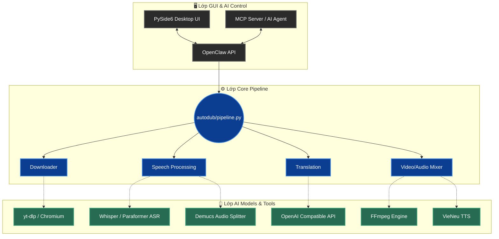

<div align="center">
  
  <h1>🎙️ DubFlow</h1>
  <p><b>Hệ thống Lồng tiếng Tiếng Việt Tự động (AI Dubbing) & Xử lý Video Toàn diện</b></p>
  
  <p>
    <a href="LICENSE"></a>
    
    
    
    <a href="#-ai-control--mcp-server"></a>
  </p>
  
  <p><i>Được tái cấu trúc và phát triển nâng cao từ ý tưởng gốc của mã nguồn <a href="https://github.com/ttthanh2044/voxdub">VoxDub</a> bởi tác giả <b>ttthanh2044</b>.</i></p>
</div>

<hr />

## 📑 Mục lục
- [Giới thiệu](#-giới-thiệu)
- [Tính năng Nổi bật](#-tính-năng-nổi-bật)
- [Kiến trúc Hệ thống](#-kiến-trúc-hệ-thống)
- [Hướng dẫn Sử dụng](#-hướng-dẫn-sử-dụng)
- [AI Control & MCP Server](#-ai-control--mcp-server)
- [Cài đặt & Triển khai](#-cài-đặt--triển-khai)
- [Dành cho Developer](#-dành-cho-developer)

## 🌟 Giới thiệu

**DubFlow** là một ứng dụng Desktop mã nguồn mở (hỗ trợ Windows/Linux) được thiết kế để tự động hóa hoàn toàn quy trình lồng tiếng (dubbing) video nước ngoài sang Tiếng Việt. 

Dự án này được **xây dựng và phát triển lại từ ý tưởng gốc của mã nguồn [VoxDub](https://github.com/ttthanh2044/voxdub)** của tác giả `ttthanh2044`. DubFlow kế thừa tầm nhìn của VoxDub nhưng được tái cấu trúc toàn diện về cả Kiến trúc phần mềm, Giao diện người dùng (Modern Dark UI/UX) và Khả năng tự động hóa (AI/MCP Control).

---

## ✨ Tính năng Nổi bật

- 🚀 **Tự động 100%**: Chỉ cần cung cấp link (YouTube, TikTok, Douyin, Bilibili) hoặc file MP4, hệ thống tự động tải, bóc băng, dịch thuật, lồng tiếng và mix nhạc nền.
- 💻 **Bảo mật Tối đa (Local Processing)**: Hoạt động hoàn toàn trên máy cá nhân, đảm bảo quyền riêng tư và không lo rò rỉ dữ liệu video/âm thanh.
- 🤖 **AI-Native & MCP**: Hỗ trợ giao thức Model Context Protocol (MCP), cho phép các AI Assistant (Claude, Gemini, Cursor) trực tiếp điều khiển phần mềm thay con người.
- 🎨 **Giao diện Modern Dark Theme**: Giao diện tối giản, tinh tế (chuẩn Cursor/Linear) tích hợp Timeline chỉnh sửa phụ đề/âm thanh chuyên nghiệp.
- 🛠 **Xử lý Hàng loạt (Batch)**: Tối ưu cho Content Creator với khả năng xử lý hàng chục video cùng lúc, lưu trạng thái tự động để chạy tiếp khi khởi động lại.

---

## 🏗 Kiến trúc Hệ thống

Hệ thống được chia làm 3 phân lớp (layers) rõ rệt, kết nối bằng cơ chế caching theo file để tối ưu hóa việc chạy lại tiến trình khi gặp sự cố:


```mermaid
graph TD
    %% Định nghĩa Style
    classDef ui fill:#2b2b2b,stroke:#666,stroke-width:2px,color:#fff
    classDef core fill:#0b3d91,stroke:#4a90e2,stroke-width:2px,color:#fff
    classDef ai fill:#276b52,stroke:#41a37c,stroke-width:2px,color:#fff

    subgraph Lớp_GUI_và_Điều_khiển ["🖥️ Lớp GUI & AI Control"]
        UI[PySide6 Desktop UI]:::ui
        MCP[MCP Server / AI Agent]:::ui
        API[OpenClaw API]:::ui
        UI <--> API
        MCP <--> API
    end

    subgraph Lớp_Core_Pipeline ["⚙️ Lớp Core Pipeline"]
        PIPE((autodub/pipeline.py)):::core
        API --> PIPE
        PIPE --> DL[Downloader]:::core
        PIPE --> SP[Speech Processing]:::core
        PIPE --> TR[Translation]:::core
        PIPE --> MIX[Video/Audio Mixer]:::core
    end

    subgraph Lớp_AI_Models_Tools ["🧠 Lớp AI Models & Tools"]
        DL -.-> YTDLP[yt-dlp / Chromium]:::ai
        SP -.-> WHISP[Whisper / Paraformer ASR]:::ai
        SP -.-> DEMUCS[Demucs Audio Splitter]:::ai
        TR -.-> OAI[OpenAI Compatible API]:::ai
        MIX -.-> FFMPEG[FFmpeg Engine]:::ai
        MIX -.-> VIENEU[VieNeu TTS]:::ai
    end
```

### 🔄 Luồng xử lý Dữ liệu (Data Flow)
1. 📥 **Input**: Tải video hoặc đọc file MP4, trích xuất âm thanh gốc (`original_audio.wav`).
2. 🎵 **Tách nhạc nền**: Sử dụng mô hình Demucs để phân tách thành `vocals.wav` (Giọng nói) và `no_vocals.wav` (Nhạc nền).
3. 📝 **ASR (Bóc băng)**: Dùng Whisper/Paraformer để nhận diện `vocals.wav` thành văn bản (Subtitle gốc).
4. 🌐 **Translate**: Dịch thuật theo ngữ cảnh (hỗ trợ Glossary, Prompt tùy chỉnh) sang Tiếng Việt.
5. 🎙️ **TTS (Lồng tiếng)**: VieNeu TTS tạo file `audio_vi_full.wav` với thời lượng khớp chính xác (Time-stretch) với câu gốc.
6. 🎬 **Mix & Render**: Trộn nhạc nền + Giọng Việt + In phụ đề cứng + Xóa chữ gốc (OCR Blur) -> xuất ra `dubbed_video.mp4`.

---

## 📖 Hướng dẫn Sử dụng

### 1. Tạo Dự án Lồng tiếng (Single Project)
- Mở thẻ **Lồng tiếng**.
- Dán đường link video (hoặc tải lên file từ máy tính).
- Cấu hình thông số:
  - **Nhạc nền**: *Demucs* (chất lượng cao) hoặc *Duck* (nhanh).
  - **Phụ đề**: File `.srt` rời hoặc *Hardsub* (in cứng vào video).
  - **OCR Blur**: Bật để tự động làm mờ phụ đề gốc của video.
- Nhấn **Bắt đầu** và thư giãn.

### 2. Chế độ Xử lý Hàng loạt (Batch Processing)
- Chuyển sang thẻ **Hàng loạt (Batch)**.
- Dán danh sách link, hỗ trợ cấu hình giọng đọc ngay trên từng dòng:
  ```text
  https://youtu.be/abc123 | nam
  https://www.douyin.com/video/789 | nu
  # Đây là dòng ghi chú
  ```
- Tiến trình được lưu tự động (State Preservation).

### 3. Trình chỉnh sửa (Editor / Timeline)
- **Giao diện 2 cột**: Dễ dàng đối chiếu phụ đề gốc và bản dịch tiếng Việt.
- **Preview Âm thanh**: Nghe thử từng câu AI đọc trực tiếp trên timeline.
- **Tiết kiệm tài nguyên**: Chỉnh sửa bản dịch và lưu lại, hệ thống chỉ tạo lại (render) âm thanh cho những câu vừa thay đổi.
- **Export Đa định dạng**: Xuất lại Video, MP3/WAV, hoặc phụ đề (.ass, .srt).

### 4. Thư viện Giọng nói AI (Voices)
- Hỗ trợ công cụ **VieNeu TTS** chất lượng cao.
- Có sẵn nhiều Preset trong thư mục `voices/preset_voices_vn/`.
- Hỗ trợ **Voice Cloning**: Sao chép giọng đọc chỉ từ 3-10 giây âm thanh mẫu. *(Vui lòng chỉ sử dụng mục đích hợp pháp).*

### 5. Dịch thuật Chuyên sâu
Tại thẻ **Cài đặt**, bạn có thể:
- Cấu hình API Endpoint tương thích chuẩn OpenAI (`/chat/completions`).
- Thiết lập **Chủ đề** (*VD: Khoa học vũ trụ, Review phim*).
- Thiết lập **Danh xưng** (*VD: Tôi - Các bạn, Huynh - Đệ*).
- Thêm **Thuật ngữ (Glossary)** để AI dịch chính xác các từ chuyên ngành.

---

## 🤖 AI Control & MCP Server

DubFlow là một trong những ứng dụng tiên phong hỗ trợ **Điều khiển hoàn toàn bởi AI (AI-Native)** thông qua giao thức **[Model Context Protocol (MCP)](https://modelcontextprotocol.io/)**.

Kết nối DubFlow với các trợ lý ảo như **Claude Desktop**, **Cursor**, hoặc **Cline**. Sau đó, bạn chỉ cần ra lệnh bằng ngôn ngữ tự nhiên:
> *"Claude, tải video tiktok này về, đổi giọng nam miền Nam rồi lồng tiếng tiếng Việt cho tôi."*

### Cách cài đặt vào Claude Desktop:
Thêm đoạn sau vào file cấu hình `%APPDATA%\Claude\claude_desktop_config.json`:
```json
{
  "mcpServers": {
    "dubflow": {
      "command": "C:/Absolute/Path/To/DubFlow/.venv/Scripts/python.exe",
      "args": ["C:/Absolute/Path/To/DubFlow/mcp_server.py"]
    }
  }
}
```
*(Đảm bảo thay thế đường dẫn thực tế của bạn)*

---

## ⚙️ Cài đặt & Triển khai

### Yêu cầu Hệ thống
- **Hệ điều hành**: Windows 10/11 hoặc Linux.
- **Phần cứng**: Khuyến nghị GPU NVIDIA (VRAM >= 8GB) để chạy Whisper & Demucs tối ưu. Nếu không có GPU, phần mềm tự động fallback sang CPU.
- **Phần mềm**: Python 3.10+ và FFmpeg.

### Cài đặt từ Source
```bash
# 1. Clone repository
git clone https://github.com/thaikhang113/dubflow.git
cd dubflow

# 2. Chạy script cài đặt (tự động tạo .venv và tải models)
cai_dat_all.bat  # Trên Windows
bash cai_dat_all.sh  # Trên Linux

# 3. Khởi động ứng dụng
chay_app.bat  # Trên Windows
bash chay_app.sh  # Trên Linux
# Hoặc lệnh Python: python -m autodub_gui
```
*(Hệ thống tích hợp Preflight Check để cảnh báo thư viện/module còn thiếu khi khởi động).*

---

## 💻 Dành cho Developer

### Đóng gói Ứng dụng (Build Release)
Bạn có thể tự đóng gói thành file `.exe` độc lập cho Windows:
```powershell
python scripts/build_exe.py --no-test
```

### Đóng góp Mã nguồn (Contributing)
Mọi đóng góp từ cộng đồng (Pull Request) cải thiện UI/UX, tích hợp model TTS mới hay sửa lỗi đều rất được hoan nghênh. 
⚠️ **Lưu ý**: Xin không commit các file chứa API keys, thư mục model dung lượng lớn, hoặc file tạm vào repository.

---

<div align="center">
  <p><b>Lưu ý Bản quyền</b></p>
  <p>Các mô hình AI đi kèm (Whisper, Demucs, VieNeu) có thể phụ thuộc vào giấy phép riêng của từng tác giả. Vui lòng kiểm tra kỹ trước khi thương mại hóa.</p>
</div>
